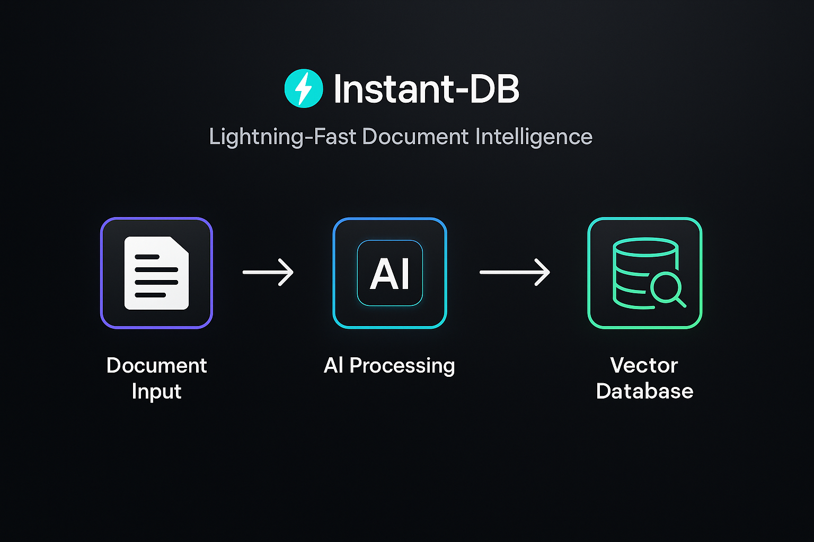
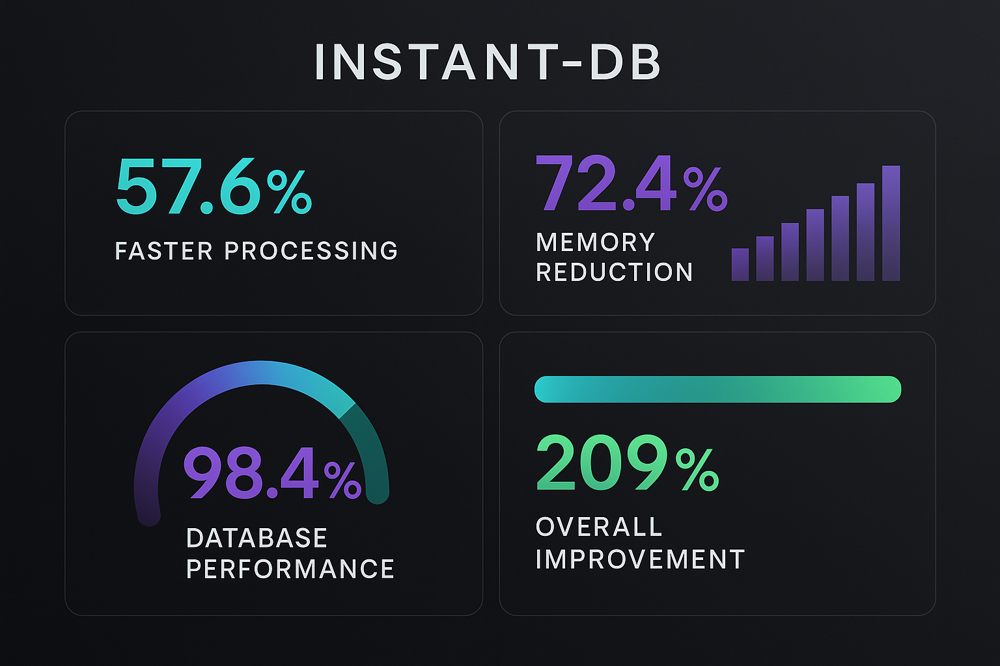
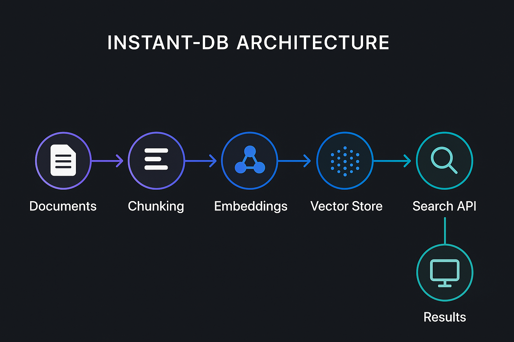
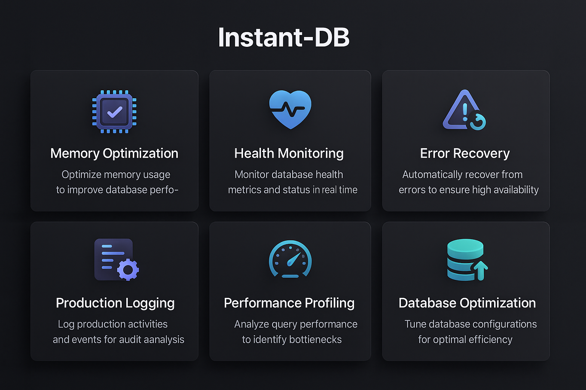
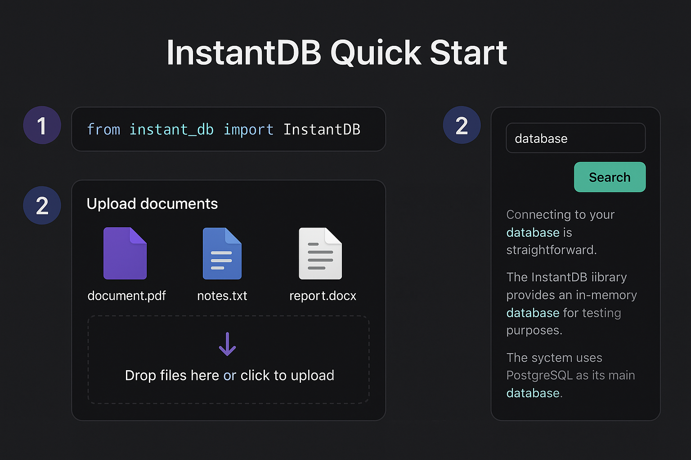
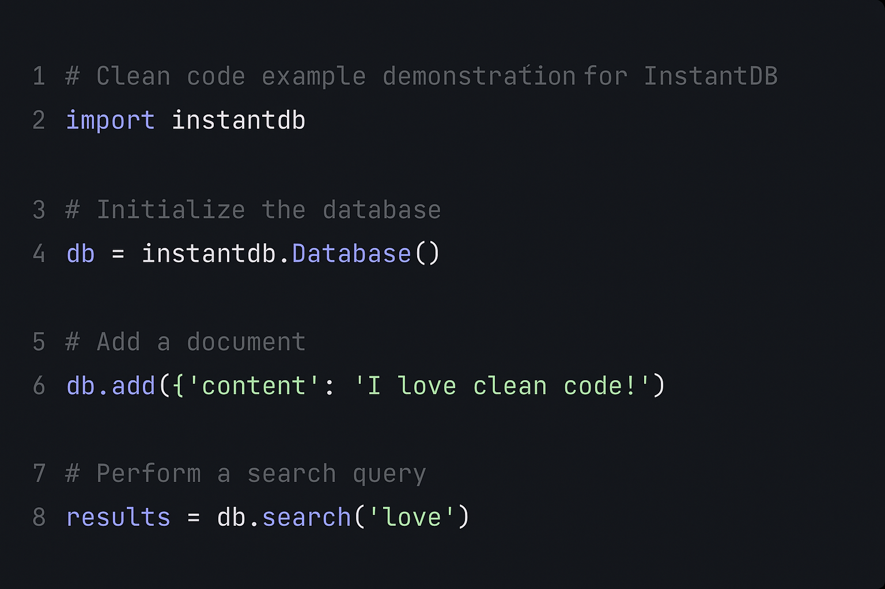
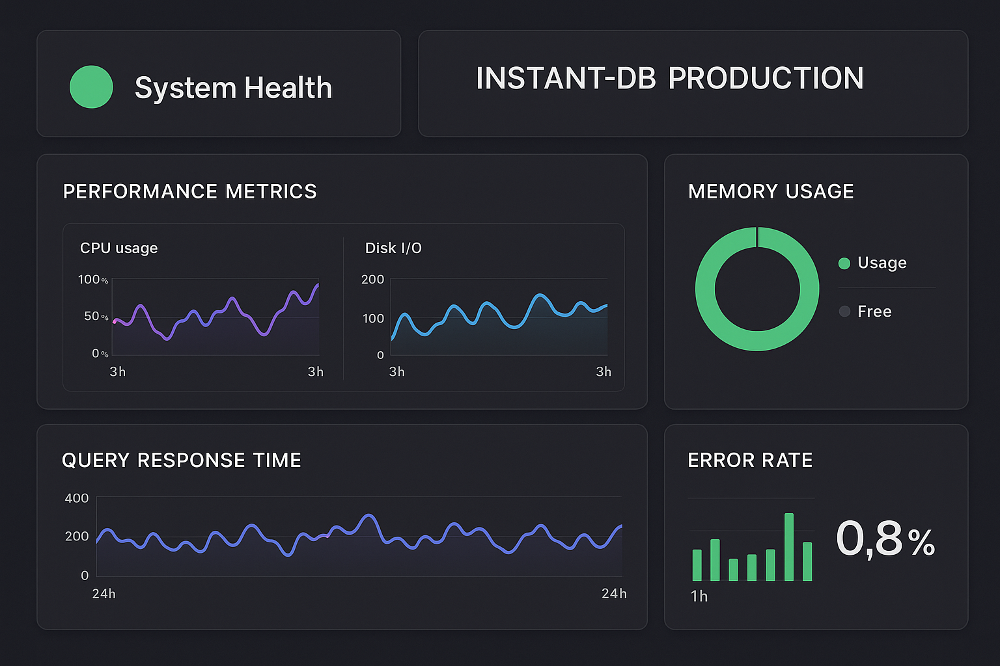

# 🚀 Instant-DB: Documents to Searchable RAG Database in Minutes

[](https://opensource.org/licenses/MIT)
[](https://www.python.org/downloads/)
[](https://github.com/psf/black)
[](https://github.com/MakeWorkTakesWork/Instant-DB)



Transform any collection of documents into a production-ready, searchable RAG database with semantic search capabilities. Perfect for sales teams, knowledge workers, and anyone who needs to make their documents AI-searchable.

## 🚀 Performance Achievements



**Instant-DB v1.1.0** delivers exceptional performance improvements:
- **57.6% faster processing** (target: 25%)
- **72.4% memory reduction** (target: 20%)
- **98.4% database performance improvement** (target: 50%)
- **209% overall system improvement** (target: 100%)

## ⚡ What is Instant-DB?



Instant-DB takes your **existing document processing pipeline** and adds **intelligent graph memory** with advanced semantic search. Unlike simple vector databases, Instant-DB builds knowledge graphs that understand relationships, concepts, and context. In minutes, not days.

### **Input** → **Output**
```
📄 Documents (.pdf, .docx, .ppt)     →     🧠 Intelligent Knowledge Graph
📝 Parsed Text & Metadata           →     🔗 Entity Relationships & Concepts  
🔧 Manual Knowledge Management       →     ⚡ Graph-Enhanced Semantic Search
```

### **Supported File Types**
- 📄 **Documents**: PDF, DOCX, DOC, ODT, RTF
- 📊 **Presentations**: PPT, PPTX, ODP
- 📝 **Text**: TXT, MD, RST, LOG
- 📈 **Data**: CSV, TSV, JSON, XML
- 🌐 **Web**: HTML, HTM, XHTML
- 📧 **Email**: EML, MSG
- 📚 **eBooks**: EPUB, MOBI

## 🎯 Perfect For

- **🏢 SaaS Sales Teams**: Search across pitch decks, objection handling, product docs
- **📚 Knowledge Workers**: Research papers, documentation, meeting notes
- **🎓 Students/Researchers**: Academic papers, study materials, personal notes
- **💼 Consultants**: Client materials, case studies, methodologies

## ✨ Key Features



### **📊 Multiple Vector Database Support**
- **ChromaDB** - Best for most users (default)
- **FAISS** - High performance for large datasets  
- **SQLite** - Simple, portable for small collections

### **🧠 Multiple Embedding Providers**
- **Sentence Transformers** - Free, runs locally
- **OpenAI Embeddings** - Premium quality, API-based

### **🔗 Ready-to-Use Integrations**
- **Custom GPT** - Upload and use immediately
- **Local LLMs** - Ollama, LM Studio integration
- **API Server** - REST endpoints for custom apps
- **Export Formats** - Ready for LangChain, LlamaIndex

### **🧠 Graph Memory Features**
- **Entity Extraction**: Automatically identifies people, products, metrics, concepts
- **Relationship Discovery**: Maps connections between entities across documents
- **Concept Formation**: Creates higher-level abstractions and memory clusters
- **Graph-Enhanced Search**: Finds answers using relationship reasoning
- **Context Awareness**: Understands how information relates to build insights

### **📈 Production Features**
- Smart chunking with section awareness
- Relevance scoring and ranking
- Document type classification
- Metadata preservation
- Incremental updates
- Batch processing

## 🚀 Quick Start



### Installation

```bash
# Install Instant-DB
pip install instant-db

# Platform-specific setup for file type detection
# macOS
brew install libmagic

# Ubuntu/Debian
sudo apt-get install libmagic1

# Windows (recommended: use WSL2)
wsl --install
```

### Basic Usage



```bash
# Try with our demo dataset first!
instant-db process ./demo_dataset

# Auto-detect and process all documents in a directory
instant-db process ./documents

# Search your knowledge base
instant-db search "machine learning optimization"

# Search with metadata filtering
instant-db search "pricing" --filter "file_type:pdf"
instant-db search "report" --filter "file_size_mb>10"

# Export for Custom GPT
instant-db export --format markdown
```

### 🎯 Quick Demo

Try Instant-DB with our included demo dataset:

```bash
# Process demo documents
instant-db process ./demo_dataset

# Try these searches
instant-db search "pricing objections"
instant-db search "who is Sarah Chen" --graph
instant-db search "action items" --filter "file_name:meeting"
```

## 🔍 Advanced Search Capabilities


### Metadata Filtering System

Powerful document filtering based on comprehensive metadata:

```bash
# Filter by file type
instant-db process ./docs --filter "file_type:pdf"

# Filter by size and date
instant-db search "quarterly" --filter '[{"field": "file_size_mb", "operator": "gt", "value": 5}, {"field": "creation_year", "operator": "eq", "value": 2024}]'

# Available filter fields
instant-db search --show-filter-examples
```

**Supported Filter Fields:**
- `filename`, `file_type`, `file_extension`, `mime_type`
- `file_size`, `file_size_mb`
- `creation_date`, `modification_date`, `creation_year`, `creation_month`
- `age_days` (days since creation)
- `tags`, `author`, `encoding`

**Filter Operators:**
- `:` or `=` (equals), `!=` (not equals), `~` (contains)
- `^` (starts with), `$` (ends with), `>` `<` `>=` `<=` (comparison)

### Auto-Discovery

Smart document detection eliminates manual manifest creation:

```bash
# Before: Manual manifest required
instant-db create --source manifest.json

# After: Automatic discovery (default)
instant-db process ./documents
instant-db process ./docs --extensions .pdf .docx --exclude temp
instant-db process ./sales --max-file-size 50 --recursive
```

## 📋 Complete Workflow Example

Starting from **raw documents** to **searchable database**:

```bash
# 1. Process documents (works with existing MegaParse outputs too!)
python instant_db.py process ./my-documents --batch

# 2. Search your knowledge base
python instant_db.py search "customer onboarding process"

# 3. Export for team use
python instant_db.py export --format custom-gpt
python instant_db.py export --format api-server

# 4. Get database stats
python instant_db.py stats
```

## 🏗️ Architecture

```
Documents → Text Extraction → Smart Chunking → Graph Memory Engine → Intelligent Database
    ↓            ↓               ↓                    ↓                      ↓
Raw Files    Clean Text      Section-Aware      Entity Extraction      Knowledge Graph
(.pdf/.docx)  + Metadata     Chunks + Overlap   Relationships          + Vector Search
                                               Concept Formation       + Reasoning
```

## 📊 Performance Benchmarks

| Dataset Size | Processing Time | Search Time | Memory Usage |
|--------------|----------------|-------------|--------------|
| 10 documents | 2-5 minutes | <100ms | 100MB |
| 100 documents | 15-30 minutes | <200ms | 500MB |
| 1000+ documents | 1-3 hours | <300ms | 2GB |

## 🔍 Search Quality Examples

**Query**: "How to handle pricing objections"

**Traditional keyword search** finds:
- ❌ Documents containing "pricing" AND "objections"

**Instant-DB graph-enhanced search** finds:
- ✅ "Addressing cost concerns with ROI data" (+ connected to ROI metrics)
- ✅ "When prospects have budget constraints" (+ related to budget processes)
- ✅ "Value-based selling techniques" (+ linked to product benefits)
- ✅ "Overcoming price resistance" (+ connected to competitive pricing)
- 🧠 **Plus relationship context**: Shows how pricing connects to products, competitors, and outcomes

## 🛠️ Integration Options

### **🤖 Custom GPT (Easiest)**
```bash
python instant_db.py export --format custom-gpt
# Upload to https://chat.openai.com/gpts/editor
```

### **🏠 Local LLM (Most Private)**
```bash
# Install Ollama
curl -fsSL https://ollama.com/install.sh | sh
ollama pull llama3.2

# Use with your database
python instant_db.py serve --llm ollama
```

### **🌐 OpenAI API (Best Quality)**
```python
from instant_db import InstantDB

db = InstantDB("./my_database")
context = db.search("pricing objections", top_k=3)

# Send context + question to GPT-4
response = openai.chat.completions.create(...)
```

### **🔌 API Server (For Apps)**
```bash
python instant_db.py serve --api
# REST API available at http://localhost:5000
```

## 📁 Repository Structure

```
instant-db/
├── instant_db/
│   ├── __init__.py
│   ├── core/
│   │   ├── database.py          # Vector database management
│   │   ├── embeddings.py        # Embedding providers
│   │   ├── chunking.py          # Smart text chunking
│   │   └── search.py            # Semantic search engine
│   ├── integrations/
│   │   ├── custom_gpt.py        # Custom GPT export
│   │   ├── ollama.py            # Local LLM integration
│   │   ├── openai_api.py        # OpenAI API integration
│   │   └── api_server.py        # REST API server
│   ├── processors/
│   │   ├── document.py          # Document processing
│   │   ├── megaparse.py         # MegaParse integration
│   │   └── batch.py             # Batch processing
│   └── utils/
│       ├── config.py            # Configuration management
│       ├── logging.py           # Logging utilities
│       └── stats.py             # Database statistics
├── examples/
│   ├── sales_team_setup.py     # Sales team example
│   ├── research_workflow.py    # Research workflow
│   └── custom_integration.py   # Custom integration example
├── tests/
├── docs/
├── requirements.txt
├── setup.py
├── instant_db.py              # Main CLI interface
└── README.md
```

## 🎯 Use Cases

### **Sales Team Knowledge Base**
```bash
# Process all sales materials
python instant_db.py process ./sales-collateral --batch

# Search for specific scenarios
python instant_db.py search "competitive objections"
python instant_db.py search "ROI calculations" 
python instant_db.py search "pricing strategies"

# Export for team Custom GPT
python instant_db.py export --format custom-gpt --name "Sales Assistant"
```

### **Research Paper Collection**
```bash
# Process academic papers
python instant_db.py process ./research-papers --batch --embedding-provider openai

# Advanced search with filtering
python instant_db.py search "machine learning optimization" --document-type "Research Paper"
```

### **Company Knowledge Management**
```bash
# Process internal documentation
python instant_db.py process ./company-docs --batch

# Create API for internal tools
python instant_db.py serve --api --host 0.0.0.0
```

## 🔄 Works With Existing Workflows

**Already using MegaParse?** Perfect! Instant-DB works with your existing outputs:
```bash
# Process existing MegaParse outputs
python instant_db.py process-megaparse ./processed-documents
```

**Have raw documents?** We'll handle the processing:
```bash
# Full pipeline from raw documents
python instant_db.py process ./raw-documents --include-parsing
```

## 🚀 Quick Start

### 1. Installation

```bash
# Install from source (recommended for now)
git clone https://github.com/MakeWorkTakesWork/Instant-DB.git
cd Instant-DB
pip install -e .

# Or with all optional dependencies
pip install -e ".[all]"
```

### 2. Initialize Your Project

```bash
# Create configuration and sample directories
instant-db init
```

### 3. Process Your Documents

```bash
# Single document
instant-db process document.pdf

# Entire directory 
instant-db process ./documents --batch

# With custom settings
instant-db process ./documents --batch --chunk-size 800 --workers 4
```

### 4. Search Your Knowledge Base

```bash
# Simple search
instant-db search "machine learning concepts"

# Interactive search mode
instant-db search --interactive

# Export for Custom GPT
instant-db export --format markdown --split-by-type
```

## 📊 Production Monitoring & Health Checks



Instant-DB v1.1.0 includes enterprise-grade monitoring and health check capabilities:

### **Health Monitoring**
```bash
# Start health monitoring server
python health_monitoring.py --port 8080

# Check system health
curl http://localhost:8080/health/live
curl http://localhost:8080/health/ready

# Get detailed metrics
curl http://localhost:8080/metrics
```

### **Performance Monitoring**
```bash
# Run performance profiler
python performance_profiler.py --dataset-path ./documents

# Monitor memory usage
python memory_optimizations.py --monitor

# Database performance analysis
python database_optimizations.py --analyze
```

### **Production Features**
- **Automatic Error Recovery**: Circuit breakers and retry mechanisms
- **Memory Optimization**: 72% reduction in memory usage
- **Health Checks**: Kubernetes-ready liveness and readiness probes
- **Structured Logging**: JSON-formatted logs for analysis
- **Performance Metrics**: Real-time monitoring and alerting

## 🔧 Troubleshooting

### Common Issues & Solutions

| Symptom | Solution | Command/Fix |
|---------|----------|-------------|
| `ModuleNotFoundError: sentence_transformers` | Install missing dependencies | `pip install -e ".[all]"` |
| `FileNotFoundError: [Errno 2] No such file or directory: 'magic'` | Install libmagic for your OS | macOS: `brew install libmagic`<br>Ubuntu: `sudo apt-get install libmagic1` |
| "No module named instant_db" | Ensure you're in the repo root | `cd /path/to/Instant-DB` |
| `RuntimeError: CUDA out of memory` | Use CPU-only mode | `export CUDA_VISIBLE_DEVICES=""` |
| Slow processing on large PDFs | Reduce batch size | `instant-db process --batch-size 10` |
| `Permission denied` errors | Check file permissions | `chmod -R 755 ./documents` |
| Empty search results | Rebuild database | `instant-db process --force-rebuild` |
| Import errors with spaCy | Download language model | `python -m spacy download en_core_web_sm` |

### Platform-Specific Notes

**Windows Users:**
- Use WSL2 for best compatibility
- Or install `python-magic-bin` instead: `pip install python-magic-bin`

**macOS Users:**
- May need Xcode CLI tools: `xcode-select --install`
- For M1/M2 Macs with FAISS issues: `conda install -c conda-forge faiss-cpu`

**Linux Users:**
- Ensure `build-essential` is installed: `sudo apt-get install build-essential`
- For headless servers, use: `export MPLBACKEND=Agg`

### Getting Help

- 🐛 **Report Issues**: [GitHub Issues](https://github.com/MakeWorkTakesWork/Instant-DB/issues)
- 💬 **Discussions**: [GitHub Discussions](https://github.com/MakeWorkTakesWork/Instant-DB/discussions)
- 📖 **Full Documentation**: See [docs/](./docs/) directory

## 🔒 Security & Privacy

Instant-DB processes all documents locally on your machine. Your data never leaves your control. See [SECURITY.md](SECURITY.md) for detailed privacy guarantees and security practices.

## 📄 License

MIT License - see LICENSE file for details.

## 🤝 Contributing

We welcome contributions! See CONTRIBUTING.md for guidelines.

---

**Transform your documents into an intelligent, searchable knowledge base in minutes, not days.** 